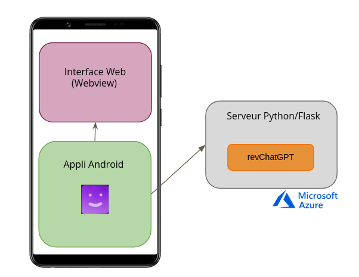
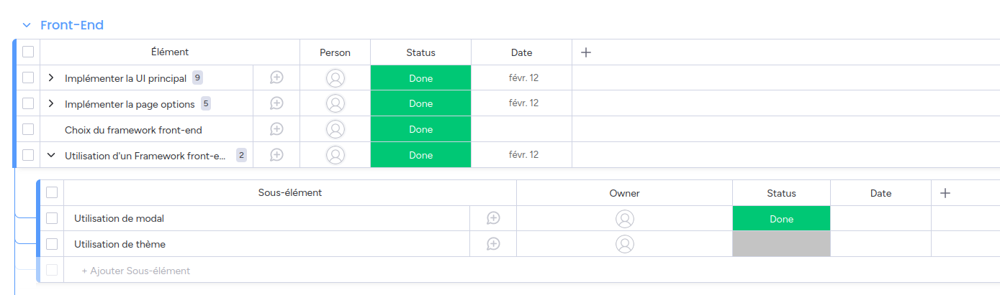
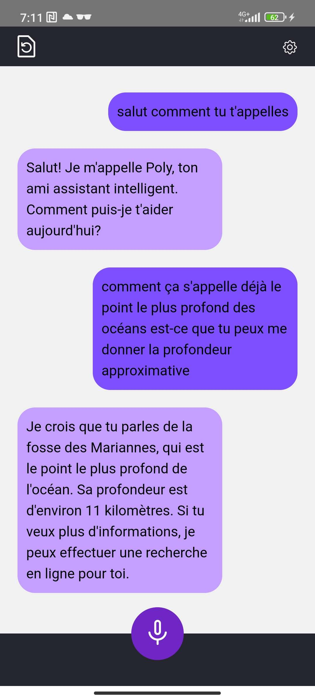
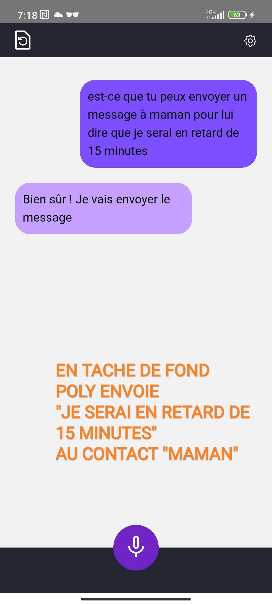

# Rapport Final

Julian ROYET, Mirette GUIRGUIS, Keming ZHANG, Georges Harrisson SIMO
***
## Sommaire
1. Introduction
2. Glossaire
3. Projet
4. Résultats
5. Métrique logicielle
6. Conclusion
7. Bibliographie
***
## 1. Introduction
Dans le cadre de notre dernière année du cycle ingénieurs en Informatique à Polytech Grenoble, il nous est proposé un projet de 2 mois nous permettant de mettre en pratique nos connaissances et nos compétences professionnelles au travers d’un cahier des charges ayant pour finalité la conception et le développement d’une application mobile en accords avec nos intérêts professionnels. 
    
Ayant une passion commune pour les technologies d'intelligence artificielles, et l’outil ChatGPT qui vient de sortir, notre groupe composé de Julian ROYET, Mirette GUIRGUIS, Keming ZHANG et Georges Harrisson SIMO YOKAM, a saisi l’opportunité d’exploiter cet intérêt commun pour soumettre l’ébauche d’un projet personnel innovant sous la direction de M.Didier DONSEZ. Dans ce rapport , on va expliquer en détails notre  projet en abordant différents aspects.
***
## 2. Glossaire
- ChatGPT: Un grand modèle de langage développé par OpenAI, conçu pour communiquer avec les humains en langage naturel
- Assistant vocal: Un programme informatique conçu pour interagir avec l'utilisateur par la voix. L'assistant vocal peut répondre à des commandes vocales et effectuer des tâches spécifiques en réponse à ces commandes.
- API: L'acronyme de "Application Programming Interface" (interface de programmation d'application). Une API est un ensemble de règles et de protocoles qui permettent à des applications de communiquer entre elles.

## 3. Projet
### 3.1 Context
L’apparition de ChatGPT est un succès remarquable dans le domaine d’intelligence artificielle. Grâce à sa haute performance comparé aux autres modèles de langage, ChatGPT a atteint 100 millions d'utilisateurs seulement deux mois après son lancement. Les gens ont tendance à utiliser de plus en plus les assistants vocaux pour faciliter leurs tâches, et cette tendance a augmenté avec l’apparition des objets connectés. L’idée de notre projet est de concevoir un assistant vocal qui utilise ChatGPT comme générateur de réponse. La raison du choix de ChatGPT est notre volonté d’avoir un assistant vocal plus intéractif que les autres qui existent déjà sur le marché.
### 3.2 Objectifs
Notre objectif dans le cadre de ce projet est de concevoir un assistant vocal sur le système d’exploitation Android. À travers cet assistant vocal, un utilisateur peut ouvrir une conversation avec ChatGPT pour demander des renseignements, ou d'effectuer des actions sur son téléphone. Les actions peuvent être par exemple de lancer un appel téléphonique, envoyer des SMS, ouvrir une vidéo youtube, etc. 
L'idée initiale était d'utiliser la capacité de ChatGPT à générer du code pour effectuer ces actions. De cette façon, pas besoin de programmer des actions à l'avance, il peut en théorie tout faire. 
En s'inspirant de Bing Chat, et de sa capacité à intégrer des recherches en ligne à ses réponses, nous voulions aussi ajouter un système de recherche automatique à l'assistant.
Nous avions également d'autres idées "bonus", différents thèmes pour l'application, un avatar dont l'expression change en fonction d'une analyse de sentiments, etc.
Une partie de ces objectifs ont été changés au cours du développement.
### 3.3 Méthodologie
#### **3.3.1 Architecture du projet**

Notre application consiste en:
1. Une interface graphique avec une webview. Cela permet de programmer l'interface avec les langages du web.

2. L'application Android. C'est le coeur de l'application, elle est responsable de la logique.

3. Un serveur qui communique avec l’API de ChatGPT pour envoyer les requêtes et recevoir les réponses. L'API de ChatGPT est dévelopée en python, et il n'est pas pratique d'executer du python sur smartphone. Il fait donc office de passerelle. Il est déployé sur Microsoft Azure.

#### **3.3.2 Technologies utilisées**
+ *Gradle*
> Gradle est un outil de build utilisé dans notre projet. Grâce à Gradle, nous avons pu configurer facilement les tâches de construction spécifiques à nos besoins comme la compilation de code. Nous avons également pu gérer efficacement les dépendances de notre projet en spécifiant les bibliothèques externes dont nous avions besoin, et Gradle a automatiquement téléchargé et intégré ces dépendances dans notre projet.

+ *HTML Javascript CSS Bootstrap jQuery*
> Nous avons choisi de passer par une Webview pour l'interface de l'application. Cette décision complique un peu l'architecture, mais nous permet d'utiliser les langages du web, plus simples, plus flexibles, et plus familiers qu'Android natif.
>L’interface utilise Bootstrap, une bibliothèque de composants graphiques. Elle offre des composants communs déjà faits avec un style prêt à l’emploi. Dans notre projet, on a utilisé les modales, menus déroulants, et les boutons.

+ *API de ChatGPT*
> Les requêtes à destination de ChatGPT sont faites en utilisant l’API revChatGPT disponible sous Python. L’API revChatGPT est non officielle, car elle n’est ni reconnue, ni soutenue par OpenAI, entreprise à l’origine de ChatGPT; c’est un projet open-source développé par une communauté de développeurs désireux de rendre ChatGPT accessible librement, en s'inspirant du site web officiel, et de leaks de OpenAI

+ *Python*
> L'utilisation de Python nous a été imposée par revChatGPT. L'idée initiale était de l'utiliser également comme langage de script que ChatGPT pourrait utiliser pour effectuer des actions sur l'appareil, mais nous avons découvert au cours du développement qu'il n'est pas possible d'interagir avec Android depuis un script Python. Il n'est donc utile que pour parler à ChatGPT, et a été déplacé sur un serveur.

+ *Flask*
> Permet de développement rapide d'un petit serveur en python, souvent utilisé pour les API.

+ *Android Speech API*
>L’assistant vocal developpé utilise la voix comme modalité d’interaction d’entrée et de sortie avec l’utilisateur. La reconnaissance vocale permet de transformer la commande vocale de l’utilisateur en un texte, qui sera par la suite utilisé pour faire des requêtes à l’API de ChatGPT.La synthèse vocale quant à elle permet d’effectuer l’opération inverse, à savoir, transformer le texte de la réponse renvoyée par ChatGPT en un discours vocal. Le kit de développement d’Android propose deux APIs pour accomplir ces tâches; Android Speech API pour la reconnaissance vocale et Android Text To Speech API pour la synthèse vocale. Ces deux APIs ont un avantage double; primo, elles sont gratuites pour un développement sous Android, et d’autre part, elles offrent une bonne précision pour la synthèse et la reconnaissance vocale, car elles reposent sur les APIs Text to Speech et Speech to Text de Google Cloud. 

+ *Android-studio*
> Nous avons utilisé Android-studio pendant la phase de développement de notre assistant vocal. Android-studio nous a fourni l’émulateur sur lequel on a pu tester notre logiciel. Il permet aussi de connecter un téléphone physique avec un câble USB ou avec le IP adresse de wifi. L’utilisation de l’émulateur dans Android-studio était bien pratique puisque notre application a été testé plusieurs versions android ce qui garantit la compatibilité de notre application avec plusieurs téléphones.

+ *Kotlin*
> Nous avons utilisé Kotlin comme langage de programmation pour coder les fonctionnalités de base de notre assistant vocal. C'est le langage recommandé pour la programmation Android. Il interoperable avec Java, nous pouvons utiliser les bibliothèques Java en codant avec du Kotlin. Dans le cadre de notre développement, nous avons appris beaucoup de notions qui sont propres au développement Android comme les intents, les activités, la gestion de droits, etc.

+ *Microsoft Azure*
>Microsoft Azure est la solution cloud developpée par Microsoft; elle permet aussi bien d’héberger des applications et des données sur des serveurs distants, que de louer de l’infrastructure en moyennant un prix en fonction des ressources consommées. Le modèle IAAS pour infrastructure en tant que service (Infrastructure As A Service), fournit de l’infrastructure à la demande telle que : les machines virtuelles, les disques de stockage, des adresses IPs, des réseaux privés virtuels… Nous avons utilisé le service IAAS de Microsoft Azure pour héberger le serveur Flask developpé dans le cadre de ce projet, en le deployant sur une machine virtuelle.

+ *Docker*
>Docker est une plateforme permettant de créer, de lancer et de déployer des conteneurs logiciels. Docker permet d’empaqueter une application et ses dépendances dans un conteneur isolé, qui pourra être exécuté sur n'importe quel serveur; ce procédé correspond à la conteneurisation. Nous avons utilisé Docker afin d’améliorer la portabilité de l’application développée. En effet, une application déployée en utilisant la conteneurisation peut être executée sur n’importe quel serveur indépendamment des problèmes de compatibilités entre les systèmes d'exploitation de la machine hôte ou de la solution cloud choisie.

+ *GitHub Actions*
>GitHub Actions est une plateforme d’intégration et de livraison continues (CI/CD) qui permet d’automatiser des pipelines de construction, de test et de déploiement. Elle permet de créer des workflows qui construisent et testent chaque requête push vers un dépôt distant, ou déployer des requêtes de pull request fusionnées en production. GitHub Actions a permis de déployer continuellement le serveur Flask après un push sur la branche de développement; ce qui consiste à construire l’image Docker du serveur, puis déployer l’image construite sur Docker Hub et enfin récupérer l’image déployée sur la VM; le tout grâce à l’ajout d’un fichier YAML de configuration. 

#### **3.3.3 Cahier de charge en résumé**
+ *Section UI*
>Les tâches à réaliser sont:
>- Faire une interface graphique de chat basique
>- Menu option pour changer de langue et de thème (Light mode et Dark mode)
>- Mettre à jour les bulles de chat en temps réel

+ *Section actions chatbot*
>Les tâches à réaliser sont:
>- Faire un appel téléphonique 
>- Envoyer SMS
>- Mettre une vidéo youtube
>- Ouvrir une application
>- Régler une alarme 

+ *Section vocale*
>- Comprendre les utilisateurs à la voix
>- Faire parler l'assistant

+ *Section serveur*
>- Utiliser ChatGPT pour la compréhensione t génération des messages
>- Créer un "prompt" qui apprend à ChatGPT à se comporter comme un assistant et à utiliser les commandes.

#### 3.3.3 Outils de gestion du projet

*Git*
>Le dépôt où se trouve le code source de notre projet. Il permet de gérer les différentes versions du projet et de travailler en collaboration entre les étudiants. Dans le cadre de notre projet, nous avons géré des concepts de git tels que gestion de conflits, merge des différentes branches avec la branche master, etc.

*Monday*

>Cet outil nous a aidé dans la gestion de notre projet. Il permet de créer des plannings. Ce qui nous a aidé à respecter l’échéancier. D’ailleurs, il était possible de créer les différentes catégories de cahier de charge et ajouter les différentes tâches.  Grâce au suivi de chacune des tâches, nous avons pu gérer notre projet.

*Discord*
>Cet outil est un outil de communication entre les équipiers. Il existe plusieurs canaux textuels et vocals, chaque canal est dédié à un sous-groupe pour travailler sur un thème spécifique. Les canaux textuels nous permettent d’avoir une trace de notre travail, les problèmes que nous avons rencontrés et leurs solutions.

*Google drive*
>C'est un outil où nous avons déposé tous les documents relatifs à notre projet. 

*Wiki AIR*
>C’est l’outil de documentation officielle de notre projet. Il permet de partager notre travail avec le professeur. Notamment, sur ce wiki il se trouve notre fiche de suivi mise à jour chaque semaine pour que le professeur nous suive.

#### 3.3.4 Difficultés rencontrées
*Kit de développement Android*
>Une difficulté particulière qu’on a rencontré en codant les différentes fonctionnalités en Kotlin c’est la comptabilité du code qu’on écrit avec toutes les versions Android. Bien que l'écriture du code avec Kotlin soit rapide et efficace, la lecture de documentation ne l'est pas autant. Le temps d'apprentissage du kotlin est assez court mais la difficulté réside plutôt dans le kit de développement Android. La base de code à apprendre est massive, et pleine de subtilités étant donné qu'il a beaucoup changé au fil des années. Il faut s’assurer que le code qu’on trouve sur Internet, ou même la documentation officielle, ne sont pas obsolètes. Il était important de trouver des ressources fiables et à jour pour éviter de coder des fonctionnalités qui pourraient ne plus fonctionner sur les versions les plus récentes d'Android.

*Services vocaux*
>D'un autre côté, l'intégration des fonctionnalités de reconnaissance vocale et de synthèse vocale à partir des services Google Cloud Speech To Text et Google Cloud Text To Speech ne s'est pas montrée concluante. En effet, ces APIs ne sont pas compatibles avec un développement Android. Il a fallu trouver une alternative pour pouvoir utiliser ces fonctionnalités. Nous avons donc opté pour l'utilisation des APIs de reconnaissance vocale et de synthèse vocale d'Android (Android Speech To Text et Android Speech To Text APIs), qui ont l'avantage d'être gratuites.

*revChatGPT*
>L'API utilisée pour ChatGPT n'était pas officielle, et OpenAI ont fait de nombreux changements de leur côté pendant la durée du projet. L'API n'a pas arrêté de changer, 4 changements de version majeurs, et plein d'autres mises à jour. Biensûr, l'interface et les fonctionnalités disponibles changaient à chaque fois, il fallait alors réécrire le code du serveur pour le refaire fonctionner.

*Python et Android*
>Pour rappel, l'idée initiale était d'utiliser Python comme langage de script que ChatGPT pourrait utiliser pour effectuer des actions sur l'appareil. Nous avons passé beaucoup de temps à faire fonctionner Python sur Android, avec succès, grâce à la bibliothèque chaquopy. Après cela nous avons passé encore plus de temps à essayer d'interagir avec Android depuis Python, mais rien à faire, ça ne semble pas être possible. La seule piste que nous avons trouvés c'est une bibliothèque permettant d'executer différents langages de script sur Android, mais celle-ci est considérée comme obsolète depuis très longtemps, on a donc abandonné l'idée, et on a déplacé l'API de ChatGPT sur un serveur à part. 

*Multithreading*
>Afin de pouvoir écouter ChatGPT tout en traitant les requêtes, le serveur devait être multithreadé. Ainsi on peut récupérer la sortie de ChatGPT en temps réel. Du côté Android, il ne faut pas bloquer le thread principal puisqu'il sert à l'affichage. Le surcharger peut rendre l'application très lente et la faire crasher. Il faut donc faire usage de multithreading à de nombreux endroids pour éviter ça, et là aussi permettre d'afficher le texte produit par la reconnaissance vocale en temps réel. 

## 4. Résultats
### 4.1 Réalisation technique 
Voici quelques exemples de conversation avec Poly

> Simple échange et question

> Utilisation d'une commande

## 5. Métrique logicielle
### 5.1 Lignes de code

>HTML: 100
>CSS: 130
>JS: 130
>Kotlin: 600
>Python: 140

>Total: 1100

>Prompt ChatGPT: 60

### 5.2 Langages
>- Kotlin
>- Python
>- HTML
>- CSS
>- Javascript
>- XML
### 5.3 Temps ingénieur
> 8 semaines * 5 jours par semaine = 40 jours
> 
> 40 jours * 6 heures par jour = 240 heures
> 
> Chaque ingénieur a travaillé environ 180 heures sur le projet.
### 5.4 La répartition des lignes de code
>- Julian: Python 140, Kotlin 370, JS 40, CSS 60, HTML 30; TOTAL 640
>- Georges-Harrisson: Kotlin 20 (gros du travail sur le devops)
>- Mirette et Keming: Kotlin 210, JS 90, CSS 70, HTML 70, TOTAL 440  
### 5.5 Les commits en pourcentage entre les membres du projet
>- Julian: 58.3%
>- Georges-Harrisson: 15.5%
>- Mirette: 11.7%
>- Keming: 14.6%

## 6. Conclusion
Nous nous sommes heurtés à bon nombre de problèmes techniques au cours de ce projet, et nou avons dû reconsidérer beaucoup de nos plans initiaux, mais nous avons fini par surmonter ces obstacles.

Au moment de l'écriture de ce rapport, il reste quelques fonctionnalités à terminer.
La recherche automatique n'est pas encore fonctionnelle, et certaines commandes ont un petit problème à régler.

Autrement nos objectifs principaux ont été atteints. On a un assistant vocal sur Android qui utilise ChatGPT pour générer ses réponses. Il fonctionne entièrement par la voix, et il est capable d'effectuer certaines actions sur le téléphone. La conversation semble plus naturelle qu'avec Google Assistant. 

Ce projet nous a permis d'apprendre la programmation d'applications Android, d'experimenter avec le prompt engineering, et de gagner en experience sur des techniques avancées comme le multithreading. 

Ont peut globalement le qualifier de réussite.

## 7. Bibliographie
- Le web page de OpenAI: https://openai.com/
- Le web page de Android-studio: https://developer.android.com/studio
- La documentation de langage Kotlin: https://kotlinlang.org/
- La documentation de Bootstrap: https://getbootstrap.com/docs/5.3/getting-started/introduction/
- La documentation de Micosoft Azure: https://learn.microsoft.com/fr-fr/azure/?product=popular
- La documentation de Docker: https://docs.docker.com/
- La documentation de GitHub Actions: https://docs.github.com/en/actions
